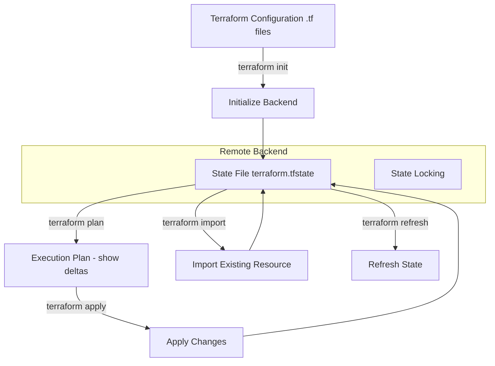

# terraform

Terraform examples.

## Terraform state

Maps the desired state defined in configuration files to the actual state of resources in your infrastructure.

# PoC List
* [GCP](./GCP/README.md)
* [AWS](./AWS/README.md)